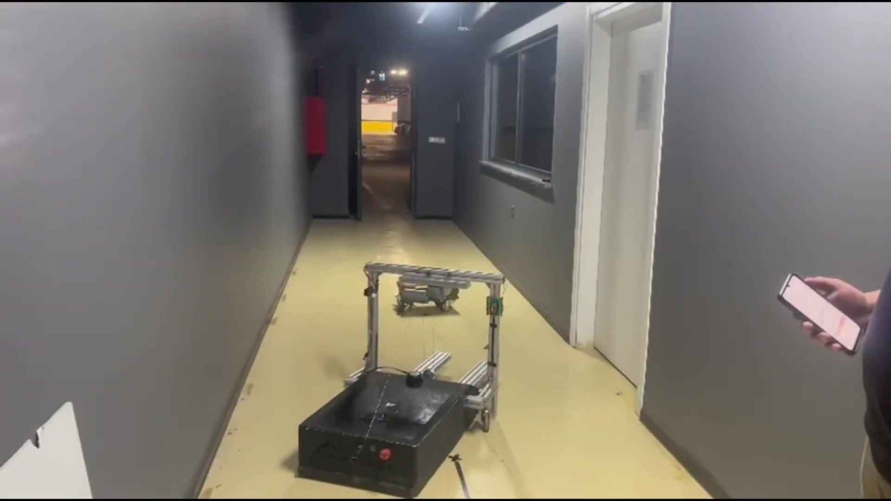
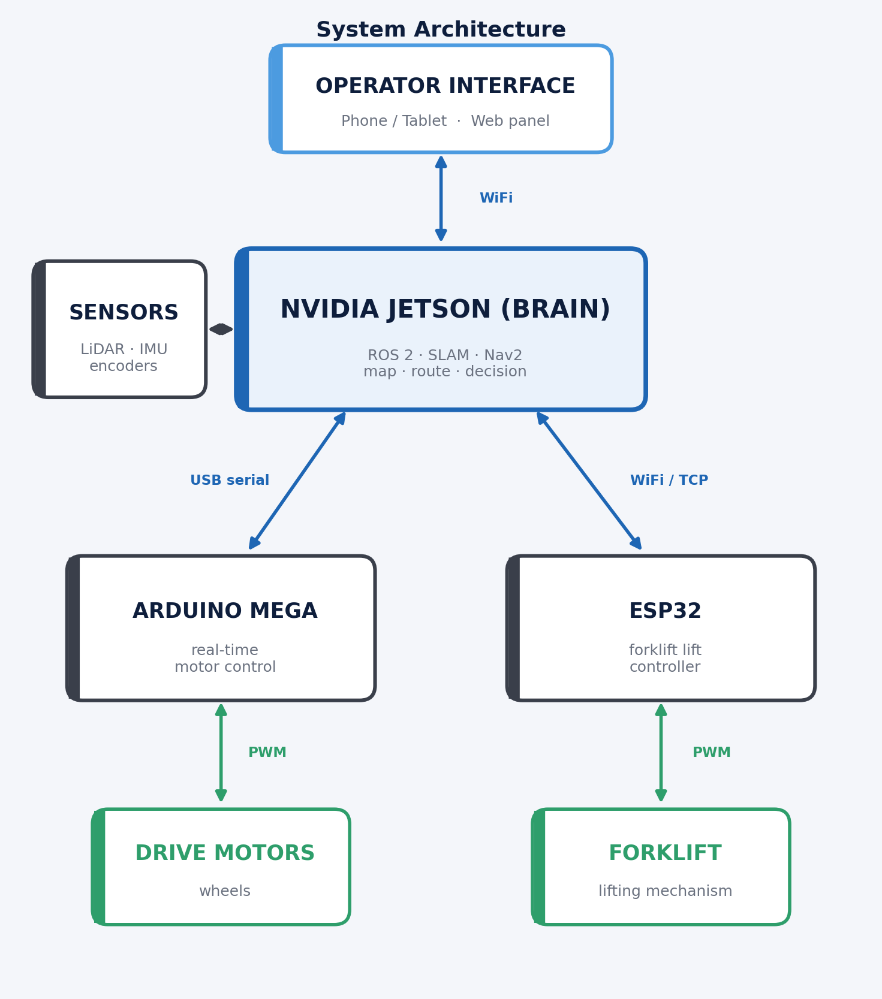
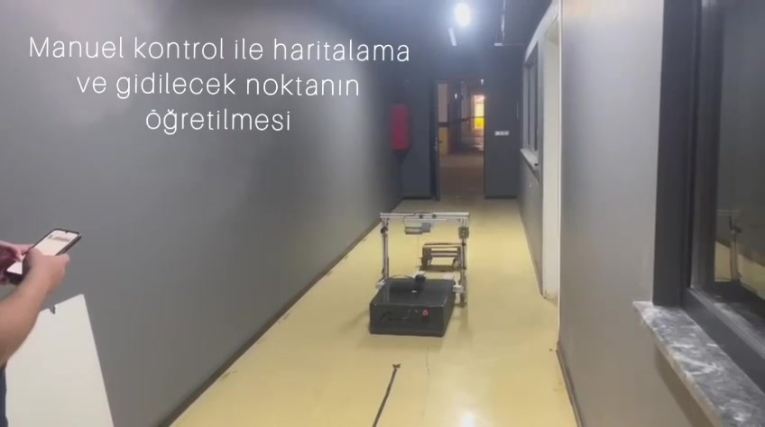
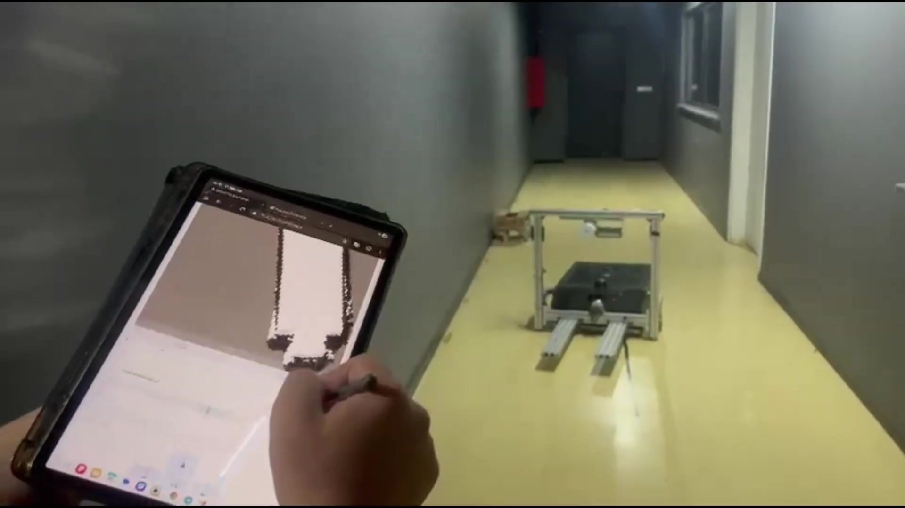
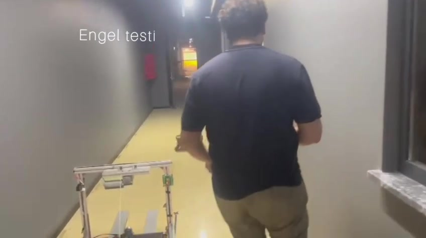
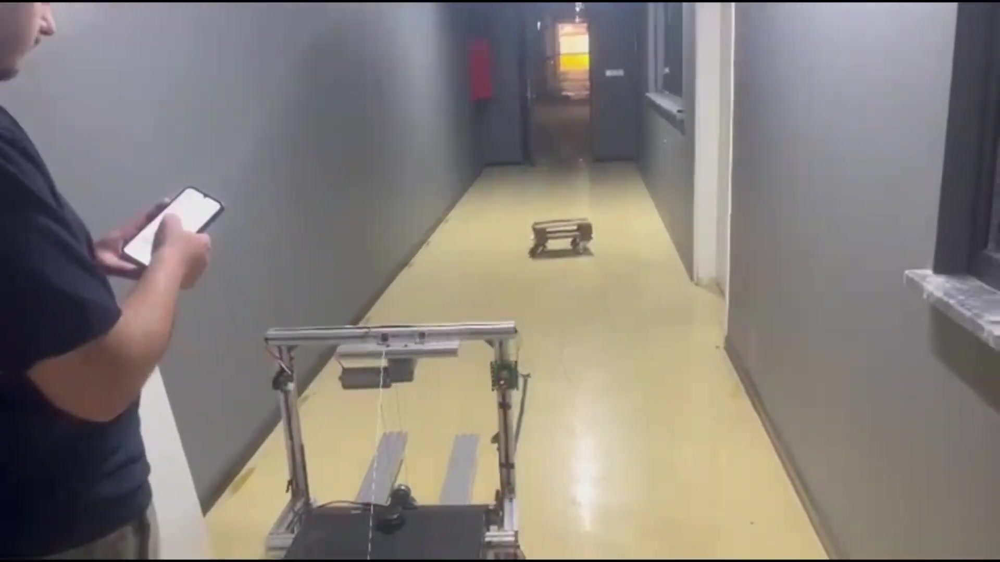

# Nebula — Autonomous Forklift AMR 🤖🚜

An **end-to-end autonomous mobile robot (AMR) forklift** built on **ROS 2 Humble** —
from real-time embedded motor control up to SLAM-based navigation and a
browser-based operator interface. Developed for an industrial material-handling
use case (TEKNOFEST 2026, Industrial Robotics category).

> This repository documents the **architecture and engineering** of the project
> and ships a runnable **Gazebo simulation** of the platform. Competition-specific
> implementation details are kept private; the focus here is the system design and
> the engineering decisions behind it.

<p align="center">
  
</p>

**▶ Watch the full demo (1:24): _[VIDEO LINK — will be added]_**

---

## What it does

The robot receives pick and drop points from an operator, builds a map of its
environment on its own, plans the shortest collision-free route, drives there
autonomously, and handles the load — while a physical mode switch enforces the
manual/autonomous separation at the **server level**, not just in the UI.

---

## My role

I was responsible for the **autonomous software stack and full system
integration** — I built this from the metal up to the navigation stack and the UI,
and made every layer talk to each other reliably:

- **Autonomy stack** — SLAM mapping, EKF-based sensor-fused localization, and
  Nav2 path planning / execution.
- **Embedded firmware** — real-time motor control on an Arduino Mega (drive
  wheels, encoders, IMU/current sensing) and a separate ESP32 controller for the
  forklift lift mechanism.
- **Communication bridges** — the links between the high-level ROS 2 layer and
  the embedded controllers, including a WiFi/TCP bridge that removed all USB
  reliability problems.
- **Operator interface** — a browser-based web panel (no client install; any
  phone/tablet on the same network connects) for mapping, navigation, point
  teaching, telemetry, and manual control.
- **Electronics & mechanical integration** — wiring, driver selection, power, and
  on-the-fly mechanical fixes to get the real vehicle running.

---

## System architecture

A deliberate **three-layer** design separates concerns by timing requirement:
heavy work (planning, perception) and millisecond-level motor control degrade each
other on one processor, so each layer does its own job.

<p align="center">
  
</p>

---

## Autonomous mission — how it works

| | Step | What happens |
|---|---|---|
|  | **1–2. Map & teach points** | The robot is driven manually once to build a 2D map; pick/drop points are taught through the interface. |
|  | **3–4. Plan & drive** | It plans the shortest collision-free route and follows it autonomously. *Left: the live map it builds; right: the real robot moving at the same time.* |
|  | **5. Stop on obstacle** | Per spec, it **stops** in front of an obstacle and resumes the **same** route once it clears — it does not re-route around it. |
|  | **6. Operate from anywhere** | The whole system is monitored and controlled from a phone/tablet over WiFi — no app install. |

---

## Engineering challenges & how I solved them

Real hardware, real debugging — the kind of problems that don't show up in a tutorial.

**1. Stop-and-resume obstacle behavior (per spec).**
The task required the robot to **stop** in front of an obstacle and resume the
**same** route once it clears — *not* to plan a detour. Standard Nav2 wants to
re-route, so I added a dedicated guard node that stores the route as one unit,
cancels tracking when an obstacle appears, and re-issues the stored path once it
clears — preserving route integrity.

**2. High-accuracy mapping (SLAM + sensor fusion).**
Clean mapping depends on clean localization. I tuned SLAM together with an EKF
that fuses wheel odometry and a 9-axis IMU, so drift from wheel slip or uneven
ground is suppressed — verifiable live by overlaying the lidar scan on the map.

**3. Unreliable USB comms → moved to WiFi/TCP.**
The forklift controller originally talked to the main computer over USB, which
suffered port renaming, udev conflicts, and transient errors. I redesigned it so
the ESP32 joins the robot's WiFi and connects as a TCP client to a bridge node.
USB is out of the loop entirely; the link auto-reconnects regardless of power-on
order.

**4. Motor control: silent 20 kHz PWM + closed-loop tuning.**
On the embedded side I replaced Arduino's default ~490 Hz `analogWrite` with
**register-level 20 kHz hardware PWM** (configuring the Mega's timers directly)
for quiet, low-ripple drive. Closed-loop wheel-velocity control lives in the ROS 2
bridge: the Mega reports measured wheel speed from the encoders, and a per-wheel
**PID plus feedforward** (static-friction + viscous terms) computes the PWM — so
the vehicle tracks velocity commands cleanly instead of lurching or overshooting.

**5. A "100% CPU" that wasn't a CPU problem.**
Autonomous motion was stuttering and the dashboard showed 100% CPU. The instant
`top` reading was misleading — the real signal was the **load average**. Root
cause: a stale build artifact running old code that spawned a subprocess on every
status poll. A clean rebuild dropped the 1-minute load from ~9.6 to ~0.4.

**6. Blind-spot filtering for the robot's own forklift.**
The lidar was seeing the robot's own forklift arms as obstacles. Instead of moving
the sensor, I added an angle-based scan filter (`scan_filter_node`) that masks the
known pillar bands within a short range, so navigation never treats the robot's own
body as an obstacle.

**7. Simulation-first, on constrained hardware.**
Every algorithm was validated in Gazebo before touching the real vehicle. The
whole ROS 2 + Gazebo + RViz toolchain ran on a 4 GB RAM laptop, which forced
disciplined, resource-aware engineering.

---

## Tech stack

| Layer | Tools |
|---|---|
| Middleware | ROS 2 Humble |
| Navigation | Nav2, SLAM Toolbox |
| Localization | EKF sensor fusion (wheel odometry + 9-axis IMU) |
| Perception | LiDAR, angle-based scan filtering |
| Embedded | Arduino Mega (drive), ESP32 / ESP-IDF (forklift), BTS7960 drivers |
| Comms | WiFi/TCP bridge, serial |
| Interface | Browser-based web panel |
| Simulation | Gazebo, RViz, py_trees behavior tree |
| Deployment | Docker (on-board compute) |

---

## What's in this repository

This repo contains a runnable **Gazebo simulation** of the platform — the URDF
model, a simulated arena, a behavior-tree autonomy node, and the scan filter — so
the architecture can be explored without the real hardware.

```
amr_forklift/
├── launch/        gazebo.launch.py · behaviors.launch.py · nav2 / slam configs
├── models/        AMR URDF (differential base + prismatic lift joint, sensors)
├── worlds/        Gazebo arena
├── config/        Nav2 / SLAM configuration
├── amr_forklift/  behavior-tree autonomy node + scan filter node
└── media/         diagrams and demo frames
```

### Build & run

```bash
# from your ROS 2 workspace root
colcon build --packages-select amr_forklift --symlink-install
source install/setup.bash

# launch the Gazebo simulation (spawns the AMR, Gazebo, RViz2)
ros2 launch amr_forklift gazebo.launch.py

# start the behavior-tree autonomy node
ros2 launch amr_forklift behaviors.launch.py
```

---

## Contact

**Furkan Karslı** — Mechatronics Engineer
[LinkedIn](https://linkedin.com/in/furkankarsli) · furknkrsli@gmail.com
